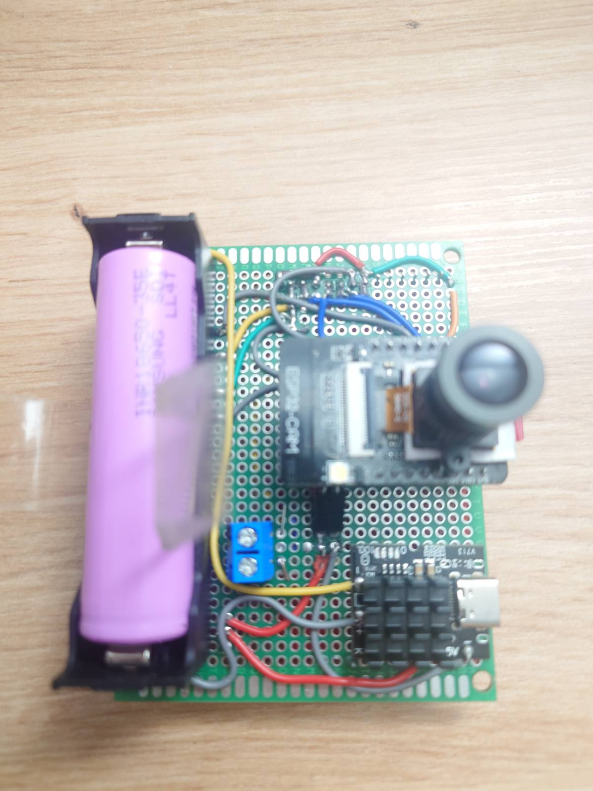
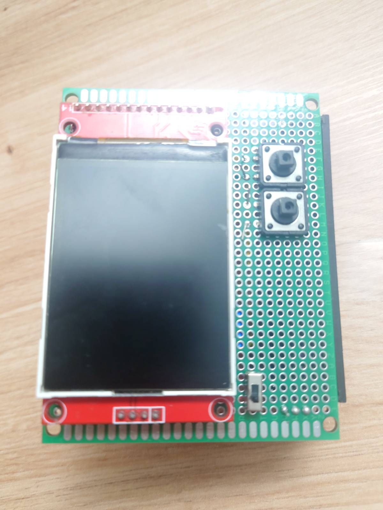

# arduino-cam

ESP32-CAM project that integrates with a TFT screen.

## Limitations

-   GPIO 16 is used as a button but also by the camera
    -   Workaround: Don't use it for taking photos
-   MicroSD card is unusable when display is turned on
    -   Workaround: Save files in SPIFFS and move them to SD-Card

## Todo

[ ] - Write README.md
[ ] - Fork Adafruit_Thermal library

[x] - Saving images to SD card
[x] - Large images don't work (over 32kb seemingly?)
[ ] - Full display resolution isn't visible (top corner of display is just black for some reason)
[ ] - Selecting file to read from for printing
[ ] - Gallery
[ ] - Settings
[ ] - Switching between apps
