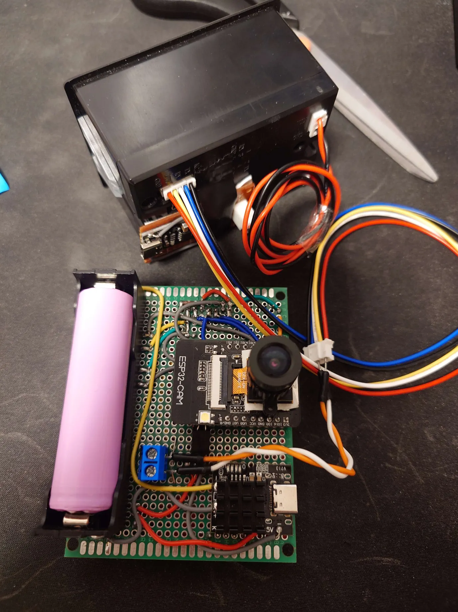

# arduino-cam

ESP32-CAM project that integrates with a TFT screen.

|  |  |
| ------------------------------------------------------ | -------------------------------------------------------- |
|                       |                         |
| ------------------------------------------------------ | -------------------------------------------------------- |

## Limitations

-   GPIO 16 is used as a button but also by the camera
    -   Workaround: Don't use it for taking photos
-   MicroSD card is unusable when display is turned on
    -   Workaround: End TFT connection while saving files

## Todo

-   Selecting file to read from for printing
-   Bluetooth serial printing?
-   Gallery
-   Flash toggle
-   Finetune filter
-   Nicer UI
-   Handling errors (don't save without SD card)
-   Prompt whether to print image
